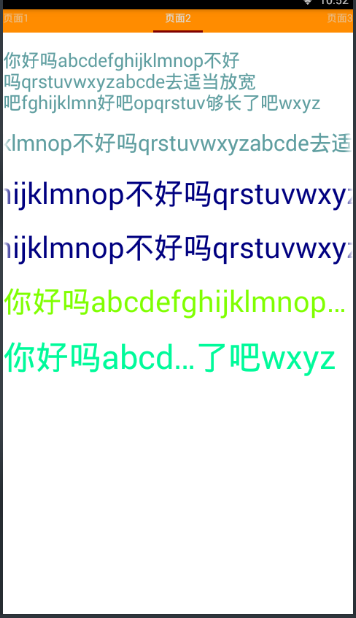

# android-base-demo
android的一些最基本的入门的例子

## 开发环境

- 操作系统：win10-64
- 开发工具：Android-Studio3.0
- gradle版本：gradle-4.1-all
- 虚拟机 MuMu

如果是其他开发环境，可能需要稍作改动

## 目录说明

    android-base-demo
    - document 文档
    - demo 源码目录
    -- AndroidExample Android 基本例子
    -- andoidexample2018 Android新UI例子
    -- build 项目构建目录
    -- gradle
    --- wrapper\gradle-wrapper.properties
    -- projectFilesBackup
    -- conn_MuMu.bat adb链接mumu虚拟机的脚本
    -- gradle.properties
    -- local.properties

其中gradle.properties配置为：
```
org.gradle.jvmargs=-Xmx512m
MaxHeapSize=1024m
android.useDeprecatedNdk=true #andoidexample2018这个项目才会用到
```

gradle-wrapper.properties配置：
```
distributionBase=GRADLE_USER_HOME
distributionPath=wrapper/dists
zipStoreBase=GRADLE_USER_HOME
zipStorePath=wrapper/dists
distributionUrl=https\://services.gradle.org/distributions/gradle-3.3-all.zip
```
如果位置不一致，则需进行相应的修改

local.properties配置：
```
ndk.dir=E\:\\ndk\\android-ndk-r13b
sdk.dir=F\:\\AdroidSDK
```
ndk是andoidexample2018会用到的，ndk和sdk都需修改成本地ndk和sdk的路径

### AndroidExample简介


这个里面包含了最基本的例子，下面是例子清单：

- 颜色表：com.study.android.activity.other.ColorActivity
- 跑马灯效果：com.study.android.activity.layerout.MarqueeActivity
- 内置浏览器：com.study.android.activity.layerout.WebActivity
- 基本样例：com.study.android.activity.layerout.BaseActivity
- 进度条：com.study.android.activity.layerout.ProgressActivity
- 时间选择器：com.study.android.activity.layerout.TimeAndDateActivity
- 复杂列表：com.study.android.activity.layerout.ListViewActivity
- 复杂网格：com.study.android.activity.layerout.GridViewActivity
- 表格布局：com.study.android.activity.layerout.TableViewActivity
- Intent实现页面跳转：com.study.android.activity.layerout.TableViewActivity
- 帧布局之霓虹灯：com.study.android.activity.layerout.FrameActivity
- Fragment实现底部导航：com.study.android.activity.layerout.FragmentActivity
- ViewPager页面浏览：com.study.android.activity.layerout.ViewPagerActivity
- FragmentPager页面：com.study.android.activity.layerout.FragmentViewPagerActivity
- ViewFliper实现图片轮番播：com.study.android.activity.layerout.ViewFlipperActivity
- ScrollView滚动：com.study.android.activity.layerout.ScrollViewActivity
- Gallery和ImageSwicher打造画廊：com.study.android.activity.layerout.GalleryAndImageSwicherActivity
- 布局优化：com.study.android.activity.layerout.YouHuaActivity
- 深入Toast：com.study.android.activity.ui.ToastActivity
- 深入Dialog：com.study.android.activity.ui.DialogActivity
- Notification通知栏：com.study.android.activity.ui.NotificationActivity
- 选项菜单和上下文菜单：com.study.android.activity.ui.MenuActivity
- SharedPreferences存储键值对：com.study.android.activity.data.SharedPreferencesActivity
- SQLite数据存取：com.study.android.activity.data.SQLiteActivity
- 文件数据存取：com.study.android.activity.data.FileActivity
- Exit：com.oyz.thisismyapp.NewMainActivity

这些例子都是在src\main\assets\config.properties文件中配置的





### andoidexample2018简介


这个里面包含了新UI布局的例子，下面是例子清单：
- 百分比布局,.demo.PercentActivity
- SnackBar/ToolBar/TextInput,.demo.SnackbarActivity
- 浮动按钮,.demo.FloatingActionButtonActivity
- 标签布局tabLayout,.demo.TabLoyoutActivity
- 导航抽屉,.demo.NavigationViewActivity
- c编译,.demo.CActivity

这些例子都是在src\main\assets\config.properties文件中配置的


## 添加新项

首先，创建好Activity和layout,然后在assets目录下的config.properties中配置：

注意:标签名称必须唯一，然后新的标签名称不能与已经定义的并非相对应的标签重名

**AndroidExample的配置方法**

项与项之间用‘|’隔开，每一项的列表项名称与Activity路径用‘-’隔开，如果需要增加新的，在后面添加‘|列表项名称-完整Activity路径’即可

```
EXAMPLE=颜色表-com.study.android.activity.other.ColorActivity|<列表项名称>-<完整Activity>路径

```
同时也支持标签解析：
```
EXAMPLE=颜色表-com.study.android.activity.other.ColorActivity|<标签名称>

<标签名称>=<列表项名称>-<完整Activity>路径
```

**andoidexample2018的配置方法**

AndroidExample的配置方法,项与项之间用‘|’隔开，每一项的列表项名称与Activity路径用‘,’隔开，如果需要增加新的，在后面添加‘|列表项名称,完整Activity路径’即可,也可以像下面这样，添加标签，然后再定义标签为‘<标签名称>=<列表项名称>-<Activity相对路径>’

```
items=percent_layout|<标签名称>
percent_layout=百分比布局,.demo.PercentActivity
<标签名称>=<列表项名称>-<Activity相对路径> #相对于AndroidManifest.xml配置的package路径： package="com.oyz.thisismyapp"
```


